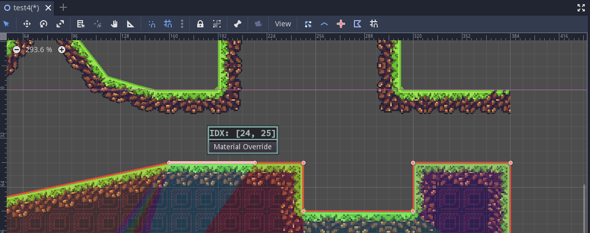

# SmartShape2D - Toolbar

<!-- TODO: Incomplete set of tools presented here. -->

## Create Mode

- In this mode you can start creating a new shape.
- Left-Click anywhere to add a new point.
- Press ESCAPE to exit create mode.
- Hold down ALT and Left-Click to create a point between the two points closest to your mouse.

## Point Mode

- In this mode you can add, delete, and move the points that make up a shape
- To **Add** a new point to the shape:
  - Hold down ALT and Left-Click anywhere on the viewport to add a point between the two points closest to your mouse.
  - Left-Click on an edge between two points.
- To **Move** a point, Left-Click on any point and drag
- To **Delete** a point, Right-Click on any point
- To set the **Control Points** of a point (for curves), hold **Shift**, Left Click on any point and drag
  - After the Control Points have been set, you can edit them individually by Left-Clicking and dragging
  - You can delete control points by right-clicking them
- To make an empty clone SmartShape2D, hold down ALT + SHIFT and Left-Click anywhere in the viewport.

## Edge Mode

- In this mode you can Move Edges and choose how specific edges are rendered
- To **Move** an Edge, Left Click and Drag the Edge
- To **Change an Edges Rendering**, right-click the edge and press "**Material Override**"

- This popup allows you to **change how edges are rendered**
  - **Render** will toggle whether this edge will be drawn with Edge Materials
  - **Set Material** allows you to choose a specific Edge Material to use to render this edge

## Origin Set

- This tool allows you to set the origin of any SmartShape
- To **Set the Origin** Left Click anywhere on the viewport

## Collision Tool

- Creates a `CollisionPolygon2D` and assigns it to the shape
- It will automatically update when the shape changes
- It can be moved where desired

## Snapping

When Moving / Adding points, snapping will cause the positions of the points to snap to the grid. This works the same as Godot's built-in snapping.
You can have snapping either use Global Space, or space relative to the shape's origin.

## More Options

More options are listed in the 3-dots-menu.

### Defer Mesh Updates

If enabled, does not update shapes immediately when moving points in the editor.
Instead, it will only update after the left mouse button has been released.

Useful if shape generation becomes too slow with complex shapes.

### Perform Version Check

Compares the project's SS2D version and installed SS2D version to determine if there have been breaking changes that require project conversion.

Usually this is not necessary to run manually, as this check is performed automatically on editor startup.

### Collision Generation Options

Related to [Collision Tool](#collision-tool).

Allows selecting a parent node where newly generated `CollisionPolygon2D` nodes will be placed.
Accepts arbitrary node paths, group names and [scene unique names](https://docs.godotengine.org/en/latest/tutorials/scripting/scene_unique_nodes.html).

If the node does not exist, it will be ignored.
